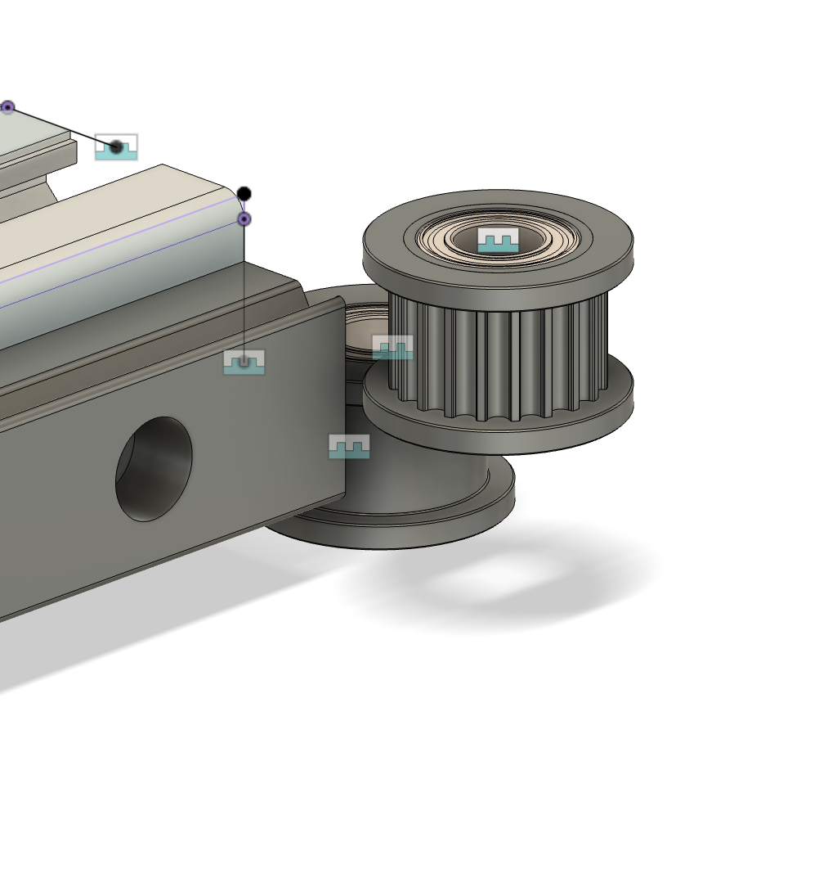
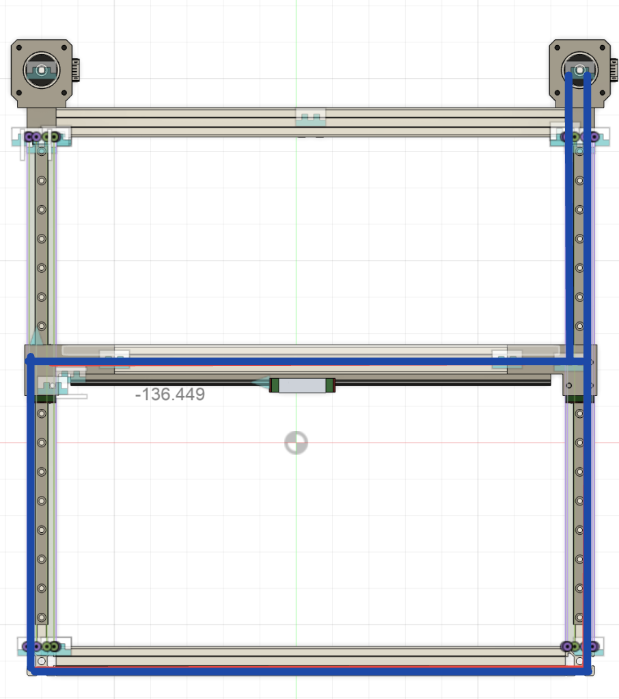
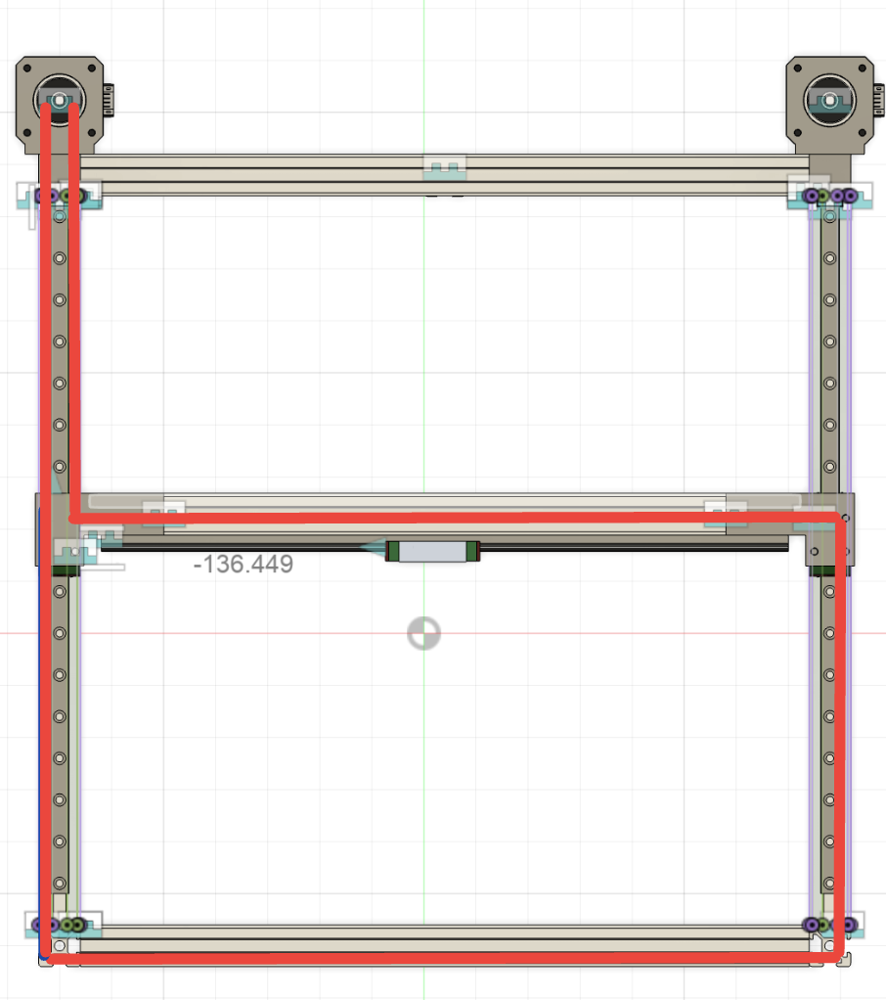

# Project Velocis

**Author: Euwain Sheard**

**Description Ultra Fast CoreXY auto ejecting 3d Printer**

**Total time spent: *17h***

## May 24 (Day 1): Started CADing and Part Sourcing

I started by looking at various parts and how they would fit into my project. This is what I decided on so far

| Part    | Price |
| -------- | ------- |
| Phaetus RAPIDO HOTEND  | $80    |
| Octopus Pro | $70    |
| Orbiter v2.5 | $50 |

I might change this later, but I like these parts

Now to Cad! I have taken inspiration from the [Voron Trident](https://vorondesign.com/voron_trident) for the design of the frame and triple lead screw z axis

### Picture of the cad

I am, however, having trouble with the extrusion files I found...

**Time spent: 2h**

## Day 1 Part 2

I worked on the Cad some more. I fixed the extrusion problems by uses [these](https://www.printables.com/model/312162-2020-2040-3030-3060-aluminum-extrusions/files) files instead. However this meant that I had to redesign the frame. When I redesigned the frame I decided to change some of the extrusion lengths. Now instead of 370, and 500, I shortened the extrusions to 350 and 450. I also modeled some of the x, and z gantry. I also organized some of the components, mainly the extrusions, into folders. I am going to use a mixture of Fusion 360's internal and external component options.

### Updated Picture of Cad

 

**Time spent: 1.5h**

## May 25 (Day 2): Cad

I started today by finishing CADing the basic frame, and looking at various linear rails. I found [these](https://www.aliexpress.us/item/2251832586981749.html?spm=2114.12010612.8148356.4.46a27cbep2UDWu&gatewayAdapt=glo2usa4itemAdapt) on the Voron sourcing guide for my y axis, but I am going to shop around for better prices. I am going to attach the Linear rails on the bottom of the aluminum extrusions, so I can install a cable chain later. 

I haven't CADed the linear rails yet, maybe I'll do that later today.

### Picture of Cad

 

**Time spent: 1.5h**

## Day 2 Part 2: Cad

I started by finding models of the linear rails I am going to use. I am going with **MGN9H** for the y axis, which is what I am designing. I have no idea how this is all going to fit into the budget. 

Then I started to CAD. I first modified the length of the files I found from 390 mm to 300 to use them in my design. Then I imported them and attached them to my frame with joints. Then I imported the carriages into the design and used a sliding joint to attach them to the rail. It took me a little time to figure out, but in the end I got it. I then imported another aluminum extrusion to work as my x axis. 

###  Pictures of Cad

Added X axis extrusion

 

One of the linear rails

 

**Time spent 1.5h** 

## Day 3 (May 26): Tried to Cad and looked up corexy kinamatics

Today I started to Cad the connectors between the x axis gantry and the y axis linear rails, and completed this only to find out that one of the linear rails was not in the right place. Then I spend way to long only to not figure it out. This problem is really frustrating. I have looked at all the joints and sketches and what not, but couldn't find the error. 

I decided to take a break and further my knowledge of corexy kinamatics. I have a basic understanding but want to learn more about it I found [this](https://corexy.com/theory.html) really useful website that explains it.

I don't have any pictures of Cad for the moment, I am still working on the error 😔

## Day 3 Part 2: Fixed error

I took a break for a bit to work on another project, after I came back to Fusion I had an idea to delete the sketch and look at the joint which was broken, and then undo it and fix the joint. This didn't work, but I was able to remake the sketch and that fixed it!.

Now I can finally work on connecting the extrusions!

I added an simple part to connect the extrusion to the linear rail, I still need to make the other one and add belt paths.

### Pictures of Cad

 

**Time spent 2h** 

## Day 4 (May 27): Cad

Today I started by mirroring the linear rail connector. I then started on the x axis linear rail. I connected the rail, but not the carriage. I will either do that later today or tomorrow.I also need to make the belt path and the idlers and pulleys.

I will upload photos of cad when I finish the x axis linear rail either later today or tomorrow.

 

**Time spent 1.5h**

## Day 4 Part 2:

While making the gantry frame I encountered an error. 

the joint was from one of the linear rails (I had previously connected the other one) to the x axis. T

I eventually fixed this error by removing one of the linear rail slider joints and it worked fine. Then I went in a search for my other linear rail. I have decided to a MGN12H linear rail.

Todo list for later

* Model Belt Path with Pulleys
* Model Z axis
* Model Hotend
* Find remaining parts

### Pictures of CAD:

 

**Time spent 1hr**

## Day 5 (May 29)

I was thinking about the 3d printer and realized I had some design flaws. I accidentally made the y axis 20 mm longer than the x axis which will make the corexy kinamatics extremely hard from the software perspective I also added a extrusion frame on top of the x axis, which is unnecessary and costly. I was also looking at my bom and it didn't line up, with my budget. I will have to work on that today, and fixing the CAD.

I worked on CAD for 40 minutes and almost got to where I left off. It goes so much faster know that I know what I am doing and already have the parts imported.

### Pictures of CAD

 

I still need to change some things, but the design looks way more doable

 

Now for the BOM. I need to cut some costs because I am somewhere in the 500s. I think my origional goal of 600 mm/s might be a stretch unless I can get some of the other parts locally for cheaper.

For example my hotend, extuder, and mainboard together cost 200 dollars alone which means that I need to get everything else for 150 dollars, which dosen't check out.

**Time spent 1hr**

## Day 5 Part 2 

I worked on Cad some more and am at the point where is was at before I changed the model. I modeled a simple version of the linear rail connectors

### Pictures of CAD

 

**Time spent 1hr**

## Day 6 (May 30): Started to Cad Belt Path

Today I started to model the belt path where the idlers will go.

**Time Spent 0.5h**

## Day 6 Part 2: 

I messed around with the position of the idlers and think I found the optimal position. I am designing the part in a different file and will just import into the main design

### Pictures of Cad

**Time Spent 1h**

## Day 6 Part 3: Finished Cad Mockup of belt path

I finished a belt path mockup for the right side of the x axis. I now need to modify it a little bit and then add it to the main design. I was experimenting with different positions, but I think I found the optimal one. I also need to switch the belts and add it to the left side

### Pictures of CAD

I was also looking at the budget. I really need to strip some of the more expensive parts to cheaper alternatives. 

## Day 7 (June 7): Modified design continued CAD

I have realized with the given budget, my expectation is too high. I am going to try to make the printer reasonably fast, but it probably wont hit the 600 mm/s I was hoping for. I have decided to move the linear rails for the y axis to the top of the gantry for simplicity of making the belt path. I have started to model these, but due to limited time I will finish them later.

### Pictures of Cad

This is the new design I am going to do

Linear Rail connector so far!

 

**Time Spent 1hr**

## Day 7 Part 2: Added Stepper Motors

I added the CAD files for the stepper motors, and made motor mounts that double as corner cubes. I am going to go with NEMA 17 48mm 56 N. I found these on the voron sourcing guide. [Stepper Motor](https://www.aliexpress.us/item/2251832403173475.html?aff_fcid=4793509057d2412bb040442114fdae87-1749333615299-02696-5E5huNIu&aff_fsk=5E5huNIu&aff_platform=link-c-tool&sk=5E5huNIu&aff_trace_key=4793509057d2412bb040442114fdae87-1749333615299-02696-5E5huNIu&terminal_id=c7e8686125bb45c1a683357c59a39ebb&gatewayAdapt=glo2usa4itemAdapt)

I also made a mockup of the 2 belt paths for reference

### Pictures of CAD 

**Time Spent 1.5hr**

## Day 8 (June 8): Cad and BOM

I started today by spending some time finishing the belt path. I am excited because this is one of the parts I felt intimidated by. I decided to route the belts on top of the printer, for simplicity in design. I might redesign some of the components later for ascetics. I am going to work on the hotend and z axis next. 

I also started my BOM. I might change some of the vendors later, but this is what I have found and modeled so far.

### Pictures of CAD

**Time Spent 2.5hr**

